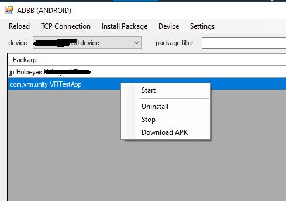

# ADBB | ADB /MLDB Debug Bridge GUI tool for Windows 10



## Overview
* Cross-platform Debug Bridge GUI tool
   - MagicLeap
   - Android / OculusQuest / Vive Focus Plus
* Avaiable on Windows 10  

## Features
   - Recognize MagicLeap or Android devices automatically
   - Install Package (apk / mpk)
   - Uninstall Package
   - Show installed third-party packages ( keyword filter available)
   - Launch selected package 
   - Terminate selected package
   - Connect selected device over wifi
   - Disconnect wifi device connection
   - Reboot a device
   - Shutdown a device
  
# How to Use.
## Requirements
This application not contains adb or mldb command.  
 You have to setup these at first.
- [Androd SDK Manager](https://developer.android.com/studio/command-line/adb.html) for Android.
- [Lumin SDK](https://creator.magicleap.com/learn/guides/develop-setup) for MagicLeap One.

## Download,Install and Setup

  1. [Download latest release](https://github.com/the6th/ADBB/releases) and unzip.
  2. Launch ADBB_merge.exe
  3. Select [Settings] > [Path to adb ] and set the location to adb.exe  
        ```
        ex: C:\Users\yourname\AppData\Local\Android\Sdk\platform-tools\adb.exe 
        ```
  4. Select [Settings] > [Path to mldb ] and set the location to mldb.exe
        ```
        ex: C:\Users\yourname\MagicLeap\mlsdk\v0.22.0\tools\mldb\mldb.exe
        ```
  
  5. Connect a device on USB.
  6. Select [Reload]


